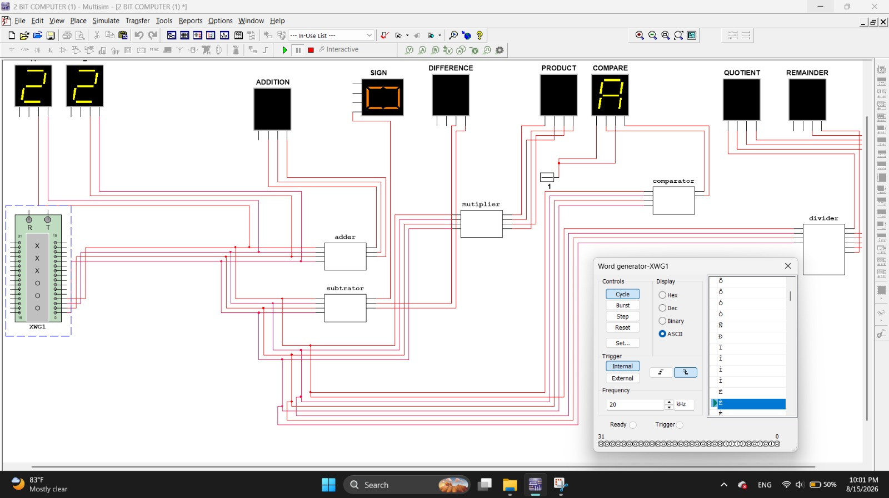
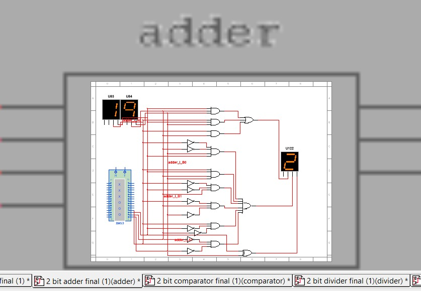
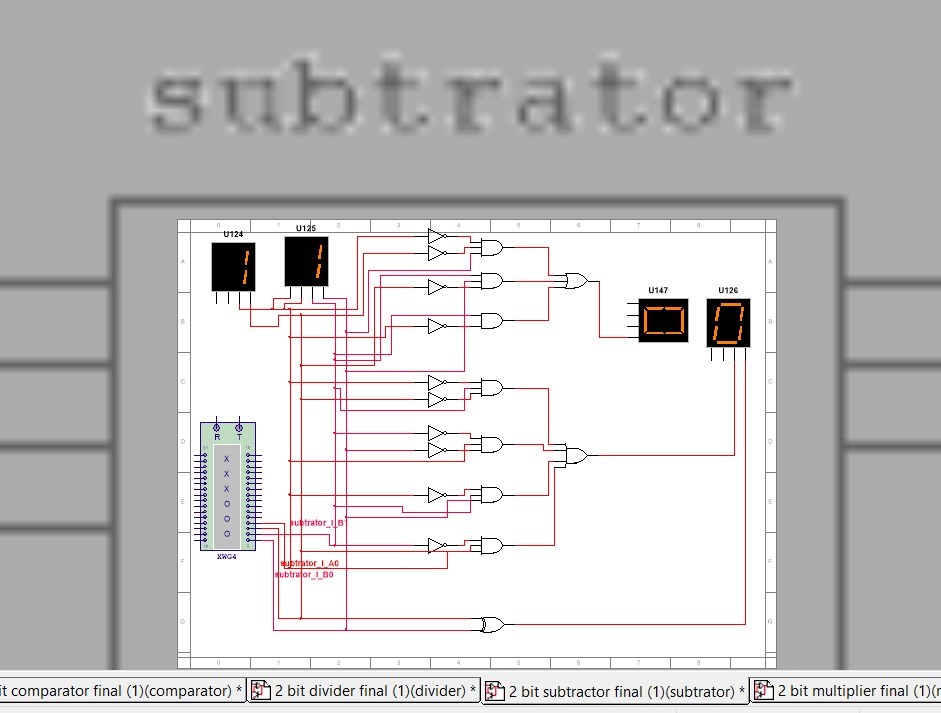
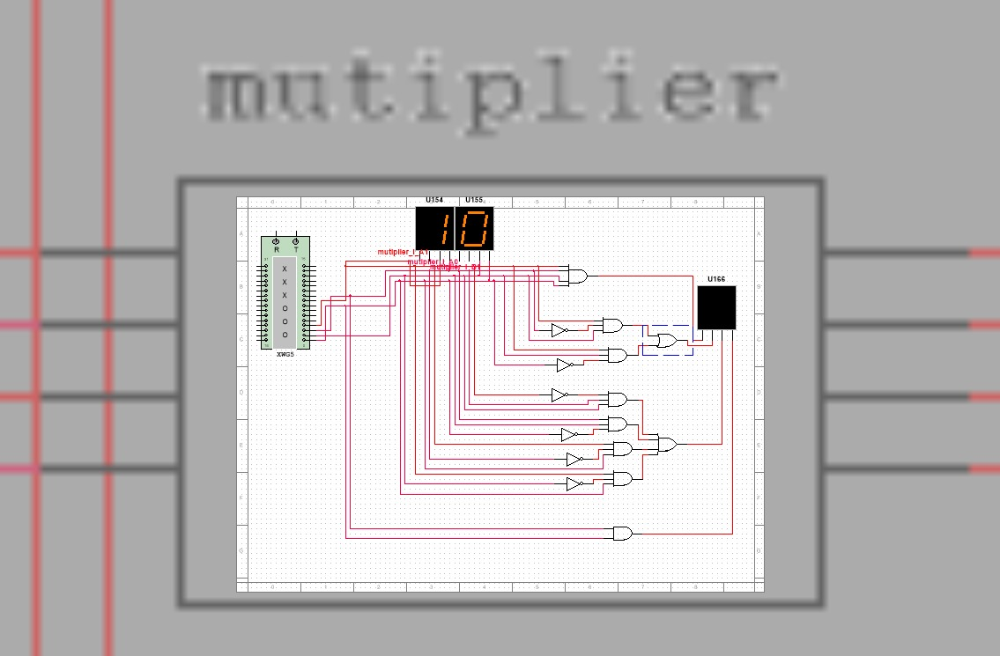
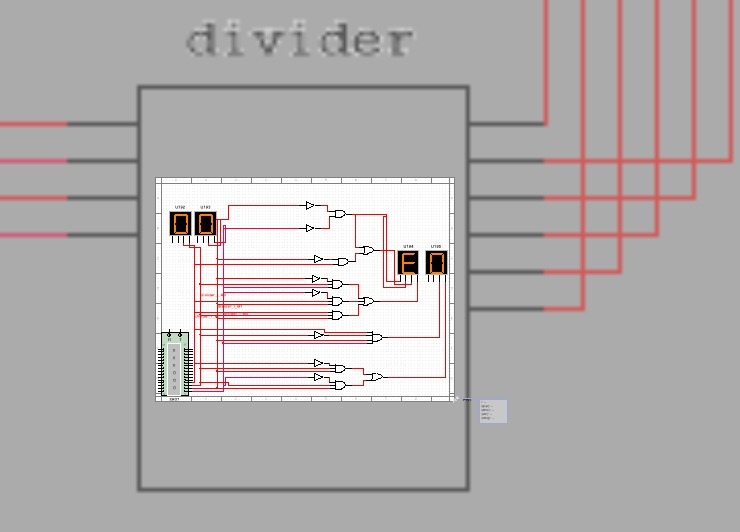
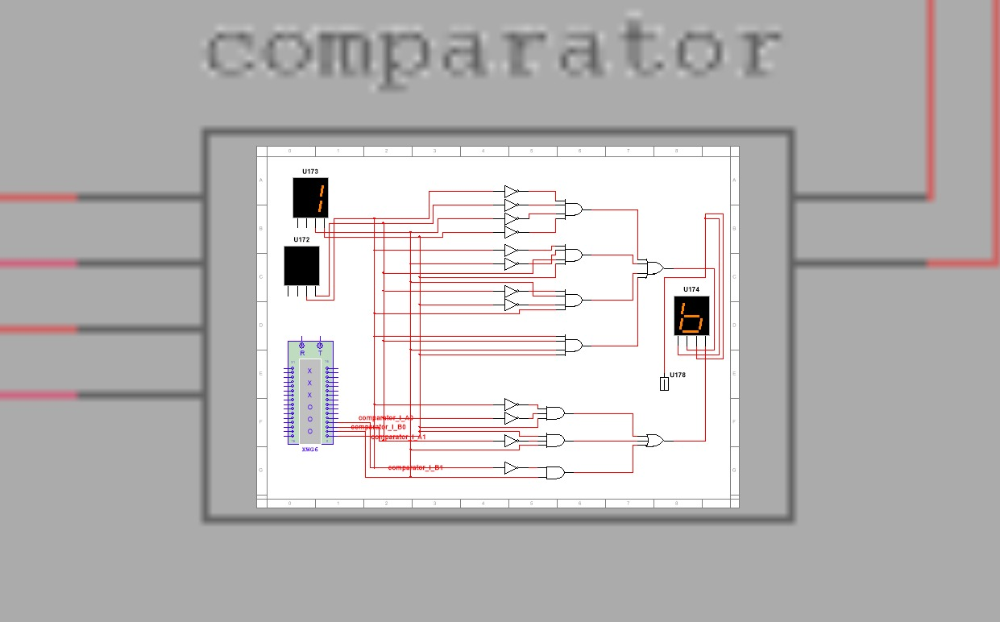

# 2-Bit Multi-Functional Digital Computer
A **2-Bit Multi-Functional Digital Computer** designed and simulated in **NI Multisim**, primarily using **basic digital logic gates and fundamental digital circuits**.

The main purpose of this project is **educational**: to understand how an **Arithmetic Logic Unit (ALU), datapath, control signals, arithmetic circuits, timing, and digital outputs** work at the gate level.

Although the system is only 2-bit, the fundamental concepts provide a useful foundation for understanding how similar principles scale into the much more complex **ALUs and datapaths used in modern 64-bit processors**.



---

## 🎯 Project Objective

The primary objective is to understand the internal working principles of an **ALU** rather than treating it as a black-box component.

The project explores:

* How binary operands are processed
* How basic gates form arithmetic circuits
* How control signals select operations
* How arithmetic results are generated
* How comparison and status information are produced
* How clock and timing affect digital systems
* How data moves through a basic processor-like datapath

### Fundamental Data Flow

```text
Input
  ↓
Word Generator
  ↓
Control & Timing
  ↓
Operation Selection
  ↓
Arithmetic / Logic Processing
  ↓
Result & Status Flags
  ↓
Digital Display
```

---

## ⚙️ Main Features

### ALU & Processing

* Addition
* Subtraction 
* Multiplication
* Division
* Comparator
* Sign detection
* Quotient generation
* Remainder generation
* Operation selection through control signals
* Result and status/flag generation

### Input / Word Generator

The input system supports multiple data representations, including:

* Binary
* Decimal
* Hexadecimal
* ASCII
* Programmable word generation

This allows different representations of data to be supplied to the digital system for testing and experimentation.

### Control & Timing

The system includes several control and timing functions:

* Clock frequency control
* Cycle mode
* Burst mode
* Step mode
* Set
* Reset
* Internal trigger
* External trigger
* Frequency-controlled word generation

These features make it possible to observe how the digital system responds to different timing and control conditions.

---

## 🖼️ Circuit Gallery

All screenshots below are captured live from the **NI Multisim** simulation. Each arithmetic/logic operation is designed as its own **gate-level sub-circuit** and then wired together in the top-level datapath. A shared **Word Generator (XWG)** supplies the 2-bit operands, and the seven-segment displays show the result in real time.

### 🖥️ Top-Level Datapath — *2 BIT COMPUTER*


The integration layer that ties every module together. A single **Word Generator (XWG1)** broadcasts the operand bits (`A1 A0`, `B1 B0`) to all functional blocks at once, and each block drives its own seven-segment output:

| Output display | Result |
|---|---|
| Operand A / Operand B | the two 2-bit inputs |
| **ADDITION** | `A + B` |
| **DIFFERENCE** + **SIGN** | `A − B` and its borrow / sign |
| **PRODUCT** | `A × B` |
| **COMPARE** | `A > B` / `A = B` / `A < B` |
| **QUOTIENT** + **REMAINDER** | `A ÷ B` |

The word-generator panel — Cycle / Burst / Step / Reset / Set, Internal & External triggers, a 20 kHz clock, and Hex / Dec / Binary / ASCII display modes — lets you drive the whole machine through every input combination.

### ➕ Adder



Computes `S = A + B` for two 2-bit operands. Built from half-/full-adder cells: **XOR** gates generate the sum bits, while **AND / OR** gates generate and propagate the carry. The word generator sweeps the inputs and the summed value appears on the output display. A 2-bit + 2-bit sum needs up to **3 bits** (max `3 + 3 = 6`).

### ➖ Subtractor 



Computes `D = A − B`. A full-subtractor network — **XOR** gates for the difference bits and **NOT + AND / OR** for the borrow chain — produces the difference together with a borrow / **sign** indication on a separate display. This is the module verified end-to-end in simulation.

### ✖️ Multiplier



Computes `P = A × B`. **AND** gates form the partial products (`Aᵢ · Bⱼ`), which are then summed by adder gates to build the final product. A 2-bit × 2-bit product needs up to **4 bits** (max `3 × 3 = 9`).

### ➗ Divider



Computes `A ÷ B`, producing a **quotient** and a **remainder** on two separate seven-segment displays. Implemented as a combinational gate network over the 2-bit operands (division-by-zero is the boundary case to watch).

### 🔍 Comparator



A 2-bit **magnitude comparator**. Bit-equality is tested with **XOR / XNOR** gates, and an **AND / OR** network resolves the three mutually-exclusive outcomes `A > B`, `A = B`, and `A < B`, which drive the COMPARE display.

---

## 🖥️ Output System

The project uses digital displays to observe the generated results.

* **Internal digital displays — Working**
* **External display interface — Under refinement**

The external display interface is currently being refined, particularly regarding output connections and synchronization.

---

## 🧠 ALU Learning Approach

A major focus of this project is understanding the ALU **from the bottom up**.

Instead of simply using a pre-built ALU IC, the project explores how fundamental digital components can be combined to create higher-level functionality.

For example:

```text
Logic Gates
    ↓
Basic Arithmetic Circuits
    ↓
Arithmetic Units
    ↓
Operation Selection
    ↓
ALU
    ↓
Control + Datapath
    ↓
Computing System
```

This provides a practical connection between **Digital Logic Design** and **Computer Architecture**.

---

## 🔢 Arithmetic Operations

For a 2-bit system, the input operands can be represented as:

```text
A = A1 A0
B = B1 B0
```

The ALU receives the operands together with operation-selection signals.

Conceptually:

```text
       A ───────────────┐
                        │
       B ───────────────┤
                        ▼
                  ┌───────────┐
Control Signals ─►│    ALU    │
                  └─────┬─────┘
                        │
                 Result + Flags
                        │
                        ▼
                    Display
```

The control signals determine which arithmetic or logical function is selected.

---

## 🕐 Clock & Control

Timing is an important part of the project.

The clock/control system allows the user to experiment with:

**Step → Cycle → Burst**

and observe how generated data is processed by the system.

The **Set** and **Reset** functions provide control over the initial and reset states of the digital system.

---

## 🛠️ Tools & Technologies

* **NI Multisim**
* Digital Logic Gates
* Combinational Logic
* Sequential Logic
* Arithmetic Circuits
* Control Logic
* Clock & Timing Circuits
* Digital Displays

---

## 📚 Learning Outcomes

This project helped develop practical understanding of:

* Digital Logic Design
* ALU Architecture
* Binary Arithmetic
* Logic Gates
* Combinational Circuits
* Sequential Circuits
* Control Signals
* Datapath Concepts
* Clock and Timing
* Status Flags
* Digital Data Representation
* Basic Computer Architecture

---

## 🔬 Why 2-Bit?

The goal was **not performance or scalability**.

A small 2-bit architecture makes it possible to manually follow the signals and understand what is happening inside the circuits.

This creates a useful learning progression:

```text
Basic Logic Gates
        ↓
1-bit Logic
        ↓
2-bit Arithmetic
        ↓
2-bit ALU
        ↓
Datapath & Control
        ↓
Understanding Larger ALUs
        ↓
Modern 32/64-bit Processor Architecture
```

The actual ALUs inside modern processors are significantly more complex and include advanced architectures, pipelining, parallel execution, wider datapaths, dedicated execution units, and many other optimizations.

This project focuses on the **fundamental principles underneath those abstractions**.

---

## 🚧 Current Status

### Working

* Basic arithmetic processing
* Subtraction
* Internal digital display
* Input/word generation
* Control and timing experimentation

### Under Development

* External display interface
* Further integration and refinement
* Additional testing and validation

---


> The `tools/` scripts currently live in the project root; move them into `tools/` if you want the layout above. The Multisim project file is not yet committed — add it under `Multisim/` so the screenshots and source stay together.

---

## 🎓 Academic / Learning Context

This project was developed as a **Digital Logic and Computer Architecture learning project**.

The emphasis is on understanding the relationship between:

**Logic Gates → Arithmetic Circuits → ALU → Control Logic → Datapath → Computer Architecture**

---

## Acknowledgement

Special thanks to **Vaidehi Ghime** for the guidance, support, and valuable learning resources throughout this project.

---

## Project Summary

> **Starting with 2 bits to understand the fundamental principles behind modern processor design.**

The project demonstrates that complex computing systems ultimately depend on fundamental digital logic operations. By building and analyzing a small system at the gate level, it becomes easier to understand the concepts hidden behind higher-level processor abstractions.

---

## Author

**Torun Roy**

Digital Logic | Computer Architecture | Hardware & Embedded Systems

---

## 📄 License

This project is intended primarily for **educational and learning purposes**. Add an appropriate open-source license to the repository if you intend to allow reuse or modification.
